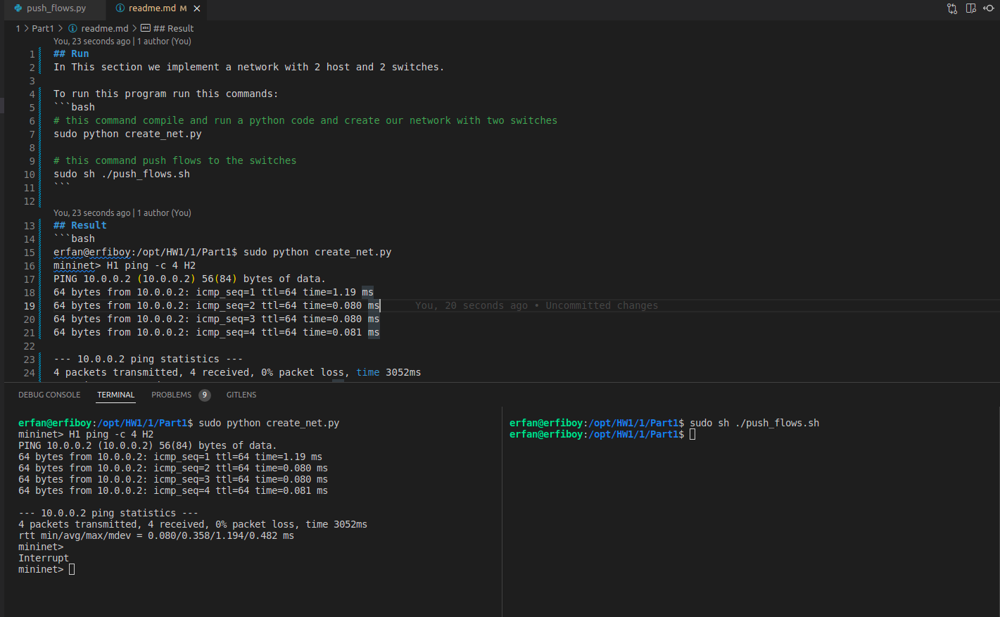

## Run 
In This section we implement a network with 2 host and 2 switches.

To run this program run this commands:
```bash
# this command compile and run a python code and create our network with two switches
sudo python create_net.py

# this command push flows to the switches
sudo sh ./push_flows.sh
```

## Result 
```bash
erfan@erfiboy:/opt/HW1/1/Part1$ sudo python create_net.py
mininet> H1 ping -c 4 H2
PING 10.0.0.2 (10.0.0.2) 56(84) bytes of data.
64 bytes from 10.0.0.2: icmp_seq=1 ttl=64 time=1.19 ms
64 bytes from 10.0.0.2: icmp_seq=2 ttl=64 time=0.080 ms
64 bytes from 10.0.0.2: icmp_seq=3 ttl=64 time=0.080 ms
64 bytes from 10.0.0.2: icmp_seq=4 ttl=64 time=0.081 ms

--- 10.0.0.2 ping statistics ---
4 packets transmitted, 4 received, 0% packet loss, time 3052ms
rtt min/avg/max/mdev = 0.080/0.358/1.194/0.482 ms
mininet> 
```

