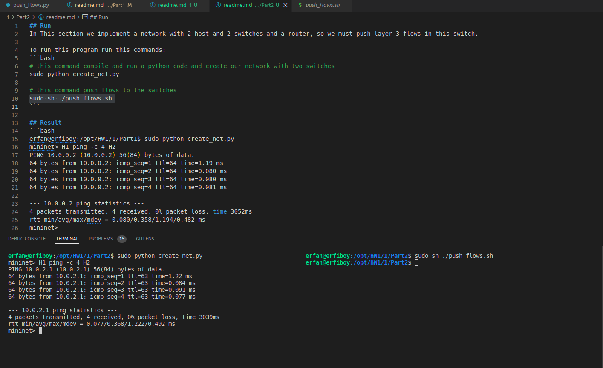

## Run 
In This section we implement a network with 2 host and 2 switches and a router, so we must push layer 3 flows in this switch.

To run this program run this commands:
```bash
# this command compile and run a python code and create our network with two switches
sudo python create_net.py

# this command push flows to the switches
sudo sh ./push_flows.sh
```

## Result 
```bash
erfan@erfiboy:/opt/HW1/1/Part1$ sudo python create_net.py
mininet> H1 ping -c 4 H2
PING 10.0.2.1 (10.0.2.1) 56(84) bytes of data.
64 bytes from 10.0.2.1: icmp_seq=1 ttl=63 time=1.22 ms
64 bytes from 10.0.2.1: icmp_seq=2 ttl=63 time=0.084 ms
64 bytes from 10.0.2.1: icmp_seq=3 ttl=63 time=0.091 ms
64 bytes from 10.0.2.1: icmp_seq=4 ttl=63 time=0.077 ms

--- 10.0.2.1 ping statistics ---
4 packets transmitted, 4 received, 0% packet loss, time 3039ms
rtt min/avg/max/mdev = 0.077/0.368/1.222/0.492 ms
mininet> 
```

