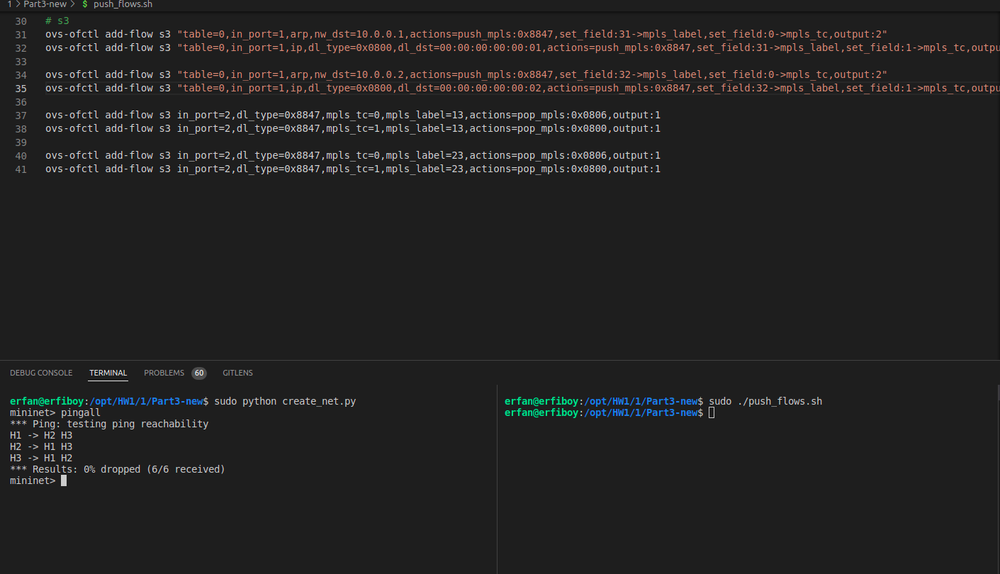
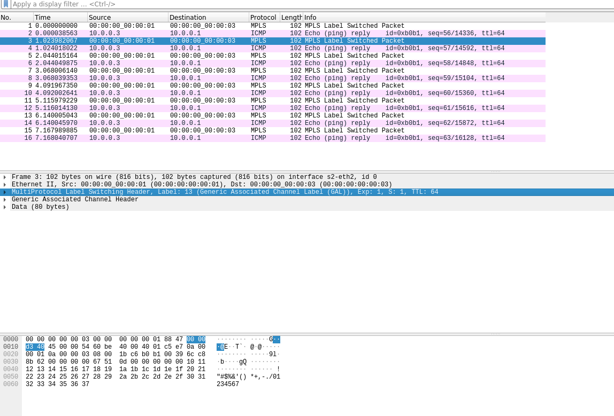
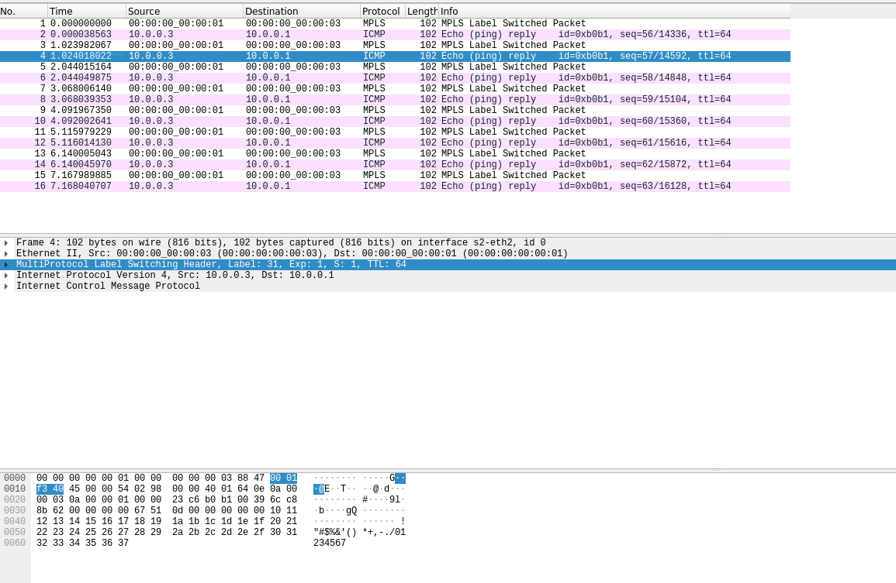

## Run 
In this section we must add a MPLS tag to packets, the challenge here was in pop MPLS when cause when we want to pop MPLS tags we must provide a protocol type so the packet cast to that protocol so we use MPLS tc to make difference between arp and ip packets.

In the question just give the 12,21,23,32 mpls tags so i have don this part in order to handle mpls packets direct from host 1 to host n.

To run this program run this commands:
```bash
# this command compile and run a python code and create our network with two switches
sudo python create_net.py

# this command push flows to the switches
sudo sh ./push_flows.sh
```

## Result 
```bash
erfan@erfiboy:/opt/HW1/1/Part3-new$ sudo python create_net.py 
mininet> pingall
*** Ping: testing ping reachability
H1 -> H2 H3 
H2 -> H1 H3 
H3 -> H1 H2 
*** Results: 0% dropped (6/6 received)
mininet> ime 3059ms
rtt min/avg/max/mdev = 0.093/0.104/0.130/0.014 ms
```



We can see that hosts can ping each other.

## Wireshark
As the question said we must provide some wireshark images to show to MPLS tags.



