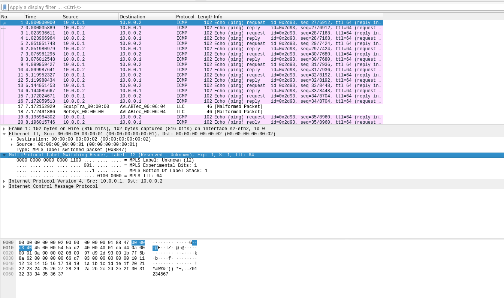
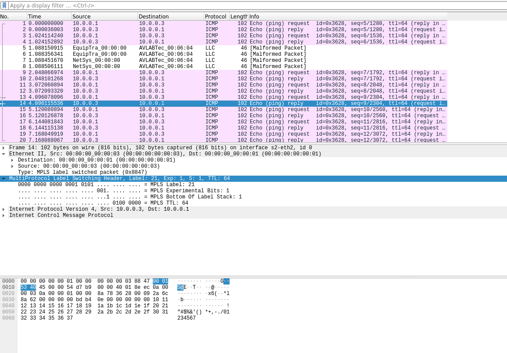
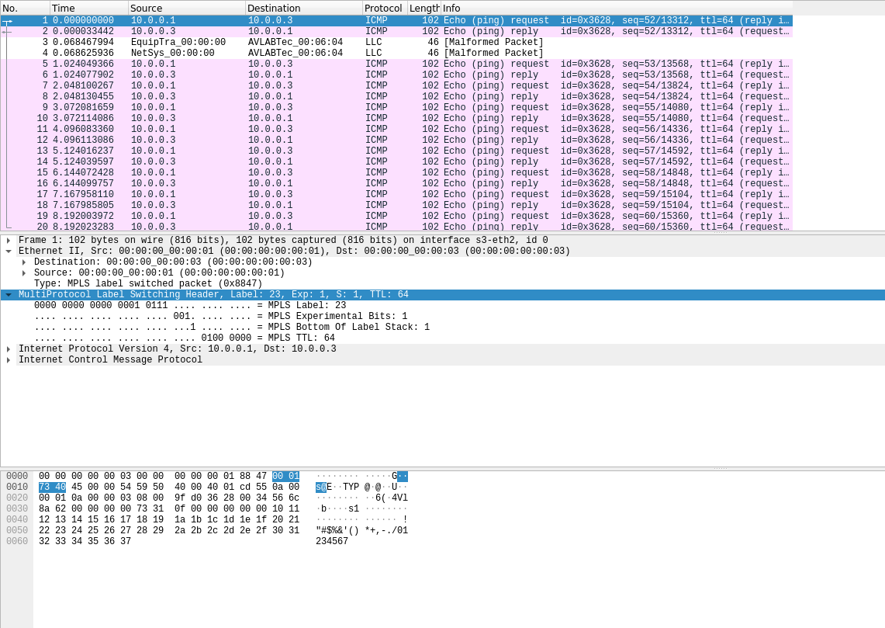
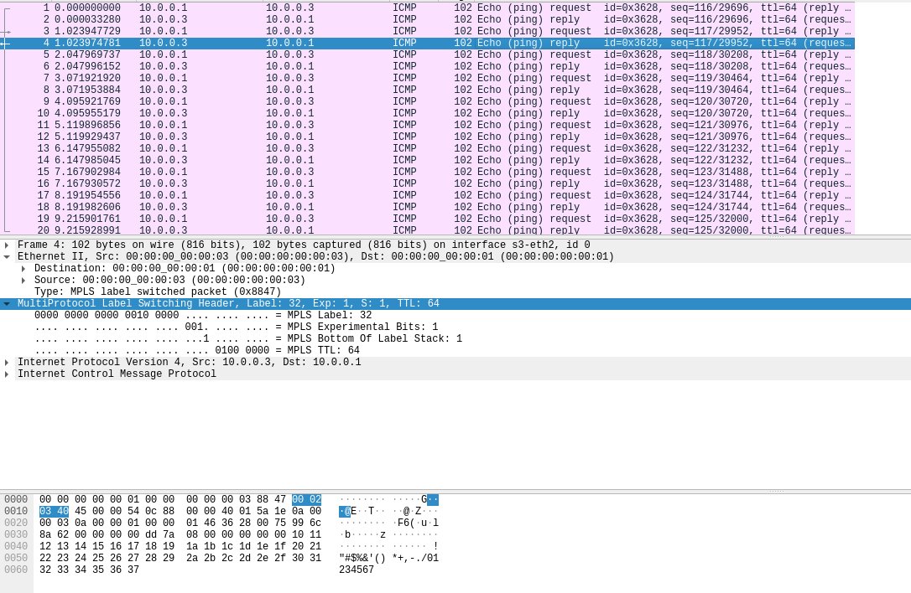

## Run 
In this section we must add a MPLS tag to packets, the challenge here was in pop MPLS when cause when we want to pop MPLS tags we must provide a protocol type so the packet cast to that protocol so we use MPLS tc to make difference between arp and ip packets.

To run this program run this commands:
```bash
# this command compile and run a python code and create our network with two switches
sudo python create_net.py

# this command push flows to the switches
sudo sh ./push_flows.sh
```

## Result 
```bash
erfan@erfiboy:/opt/HW1/1/Part1$ sudo python create_net.py
mininet> H1 ping -c 4 H2
PING 10.0.2.1 (10.0.2.1) 56(84) bytes of data.
64 bytes from 10.0.2.1: icmp_seq=1 ttl=63 time=1.22 ms
64 bytes from 10.0.2.1: icmp_seq=2 ttl=63 time=0.084 ms
64 bytes from 10.0.2.1: icmp_seq=3 ttl=63 time=0.091 ms
64 bytes from 10.0.2.1: icmp_seq=4 ttl=63 time=0.077 ms

--- 10.0.2.1 ping statistics ---
4 packets transmitted, 4 received, 0% packet loss, time 3039ms
rtt min/avg/max/mdev = 0.077/0.368/1.222/0.492 ms

mininet> H1 ping -c 4 H3
PING 10.0.0.3 (10.0.0.3) 56(84) bytes of data.
64 bytes from 10.0.0.3: icmp_seq=1 ttl=64 time=0.130 ms
64 bytes from 10.0.0.3: icmp_seq=2 ttl=64 time=0.093 ms
64 bytes from 10.0.0.3: icmp_seq=3 ttl=64 time=0.098 ms
64 bytes from 10.0.0.3: icmp_seq=4 ttl=64 time=0.098 ms

--- 10.0.0.3 ping statistics ---
4 packets transmitted, 4 received, 0% packet loss, time 3059ms
rtt min/avg/max/mdev = 0.093/0.104/0.130/0.014 ms
```


We can see that hosts can ping each other.

## Wireshark
As the question said we must provide some wireshark images to show to MPLS tags.




