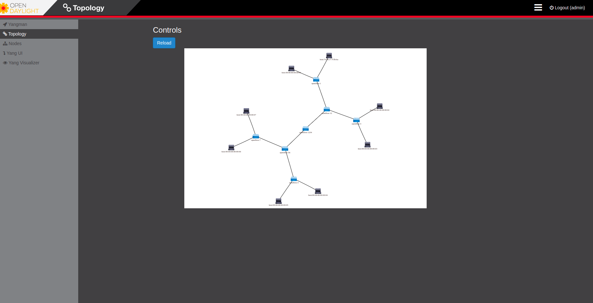
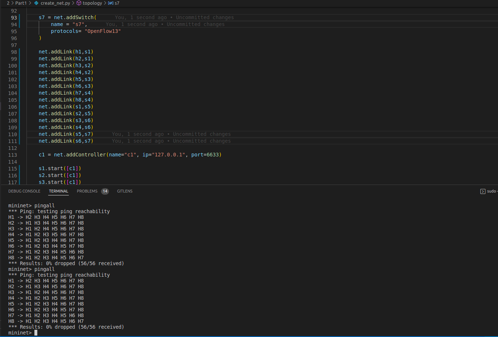

## Run 
In this section we implement an tree lan topology and let the OpenDayLight controller create flows automatically.
To run this program run this commands:
```bash
# this command compile and run a python code and create our network with two switches
sudo python create_net.py

# Start the OpenDayLight controller
karaf/bin$./karaf

## Use command below to install features
feature:install (your feature)
```

## Result 
```bash
mininet> pingall
*** Ping: testing ping reachability
H1 -> H2 H3 H4 H5 H6 H7 H8 
H2 -> H1 H3 H4 H5 H6 H7 H8 
H3 -> H1 H2 H4 H5 H6 H7 H8 
H4 -> H1 H2 H3 H5 H6 H7 H8 
H5 -> H1 H2 H3 H4 H6 H7 H8 
H6 -> H1 H2 H3 H4 H5 H7 H8 
H7 -> H1 H2 H3 H4 H5 H6 H8 
H8 -> H1 H2 H3 H4 H5 H6 H7 
*** Results: 0% dropped (56/56 received)
mininet> pingall
*** Ping: testing ping reachability
H1 -> H2 H3 H4 H5 H6 H7 H8 
H2 -> H1 H3 H4 H5 H6 H7 H8 
H3 -> H1 H2 H4 H5 H6 H7 H8 
H4 -> H1 H2 H3 H5 H6 H7 H8 
H5 -> H1 H2 H3 H4 H6 H7 H8 
H6 -> H1 H2 H3 H4 H5 H7 H8 
H7 -> H1 H2 H3 H4 H5 H6 H8 
H8 -> H1 H2 H3 H4 H5 H6 H7 
*** Results: 0% dropped (56/56 received)
```

## topology


## ping hosts


## Describe Flows
flows in the root switch:

```bash
### this flow sends packets to the controllers prot
 cookie=0x2b0000000000000d, duration=201.579s, table=0, n_packets=80, n_bytes=6800, priority=100,dl_type=0x88cc actions=CONTROLLER:65535

### this flow send all the packets from left root leaf to right root leaf which is the in_port and output
 cookie=0x2b0000000000000c, duration=195.921s, table=0, n_packets=271, n_bytes=24839, priority=2,in_port="s7-eth1" actions=output:"s7-eth2"

 ### this flow send all the packets from left root leaf to right root leaf which is the in_port and output
 cookie=0x2b0000000000000d, duration=195.921s, table=0, n_packets=273, n_bytes=25105, priority=2,in_port="s7-eth2" actions=output:"s7-eth1"

 ### packet which not have the above tags will be drop
 cookie=0x2b0000000000000d, duration=201.580s, table=0, n_packets=32, n_bytes=4342, priority=0 actions=drop
```
