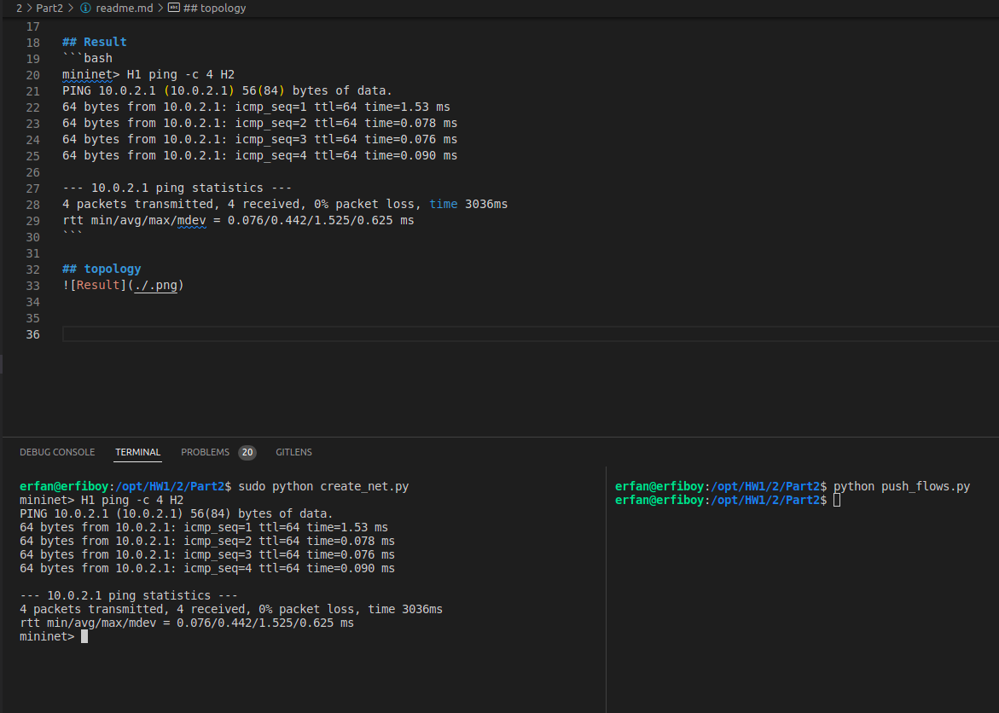

## Run 
In this part we push the flows of the network same as question 1 part 2 to OpenDayLight controller.

> make sure that you disabled the odl-l2switch-all  

To run this program run this commands:
```bash
# this command compile and run a python code and create our network with two switches
sudo python create_net.py

# Start the OpenDayLight controller
karaf/bin$./karaf

## Use command below to install features
feature:install (your feature)
```

## Result 
```bash
mininet> H1 ping -c 4 H2
PING 10.0.2.1 (10.0.2.1) 56(84) bytes of data.
64 bytes from 10.0.2.1: icmp_seq=1 ttl=64 time=1.53 ms
64 bytes from 10.0.2.1: icmp_seq=2 ttl=64 time=0.078 ms
64 bytes from 10.0.2.1: icmp_seq=3 ttl=64 time=0.076 ms
64 bytes from 10.0.2.1: icmp_seq=4 ttl=64 time=0.090 ms

--- 10.0.2.1 ping statistics ---
4 packets transmitted, 4 received, 0% packet loss, time 3036ms
rtt min/avg/max/mdev = 0.076/0.442/1.525/0.625 ms
```

## topology



