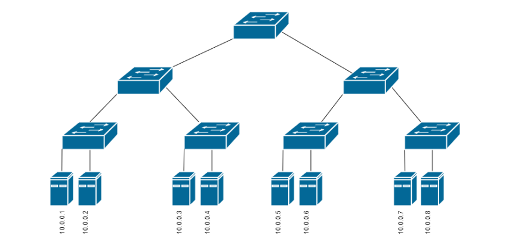

# OpenDayLight
In this part we learn to how to use OpenDayLight controller. And we implement some code which automatically push flows to OpenDayLight controller.

## [Part 1](https://github.com/erfiboy/SDMN/tree/master/2/Part1)
In this part we create a network in the image below and connect the switches to the controller and add features so that the controller can add flows to switches. In this part flow tables creates by OpenDayLight controller.

## [Part 2](https://github.com/erfiboy/SDMN/tree/master/2/Part2)
In this part we do what just we have done in the [question one part 2](https://github.com/erfiboy/SDMN/tree/master/1/Part2) but we push flows to OpenDayLight controller instead.