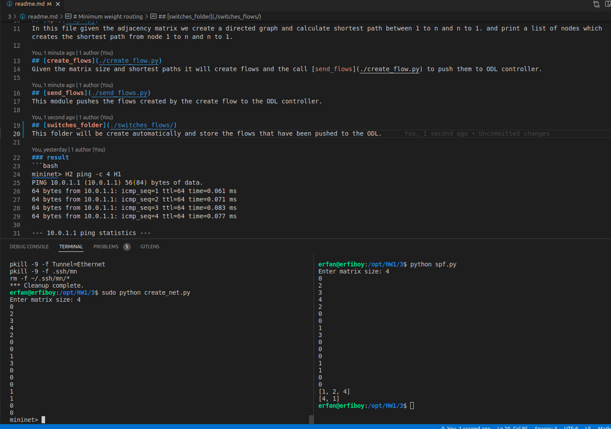
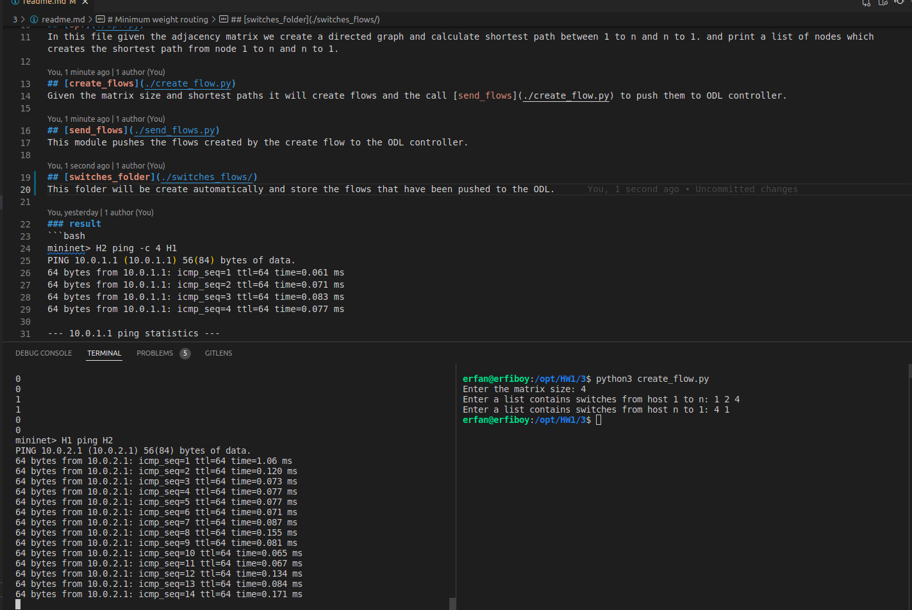

# Minimum weight routing
In this problem, we want you to implement a minimum cost path routing algorithm on a network.
You are provided an adjacency matrix A ∈ Rn×n that holds link weights between n switches in the
network
We use [NetworkX](https://networkx.org/) to find the shortest path. In the create network we create a network based on the adjacency matrix so we get a matrix as an input (each element must followed by an enter). after that we create IP and ARP flows and the push it to the ODL controller.

## [create_net](./create_net.py)
In this file given the adjacency matrix we create a directed graph using the matrix and connect switches to ODL controller.

## [spf](./spf.py)
In this file given the adjacency matrix we create a directed graph and calculate shortest path between 1 to n and n to 1. and print a list of nodes which creates the shortest path from node 1 to n and n to 1.

## [create_flows](./create_flow.py)
Given the matrix size and shortest paths it will create flows and the call [send_flows](./create_flow.py) to push them to ODL controller.

## [send_flows](./send_flows.py)
This module pushes the flows created by the create flow to the ODL controller.

## [switches_folder](./switches_flows/)
This folder will be create automatically and store the flows that have been pushed to the ODL.

### result 
```bash
mininet> H2 ping -c 4 H1
PING 10.0.1.1 (10.0.1.1) 56(84) bytes of data.
64 bytes from 10.0.1.1: icmp_seq=1 ttl=64 time=0.061 ms
64 bytes from 10.0.1.1: icmp_seq=2 ttl=64 time=0.071 ms
64 bytes from 10.0.1.1: icmp_seq=3 ttl=64 time=0.083 ms
64 bytes from 10.0.1.1: icmp_seq=4 ttl=64 time=0.077 ms

--- 10.0.1.1 ping statistics ---
4 packets transmitted, 4 received, 0% packet loss, time 3077ms
rtt min/avg/max/mdev = 0.061/0.073/0.083/0.008 ms
mininet> H1 ping -c 4 H2
PING 10.0.2.1 (10.0.2.1) 56(84) bytes of data.
64 bytes from 10.0.2.1: icmp_seq=1 ttl=64 time=0.068 ms
64 bytes from 10.0.2.1: icmp_seq=2 ttl=64 time=0.094 ms
64 bytes from 10.0.2.1: icmp_seq=3 ttl=64 time=0.069 ms
64 bytes from 10.0.2.1: icmp_seq=4 ttl=64 time=0.079 ms

--- 10.0.2.1 ping statistics ---
4 packets transmitted, 4 received, 0% packet loss, time 3076ms
rtt min/avg/max/mdev = 0.068/0.077/0.094/0.010 ms
mininet> 
```

## create network and find minimum path 


## push flows and ping
