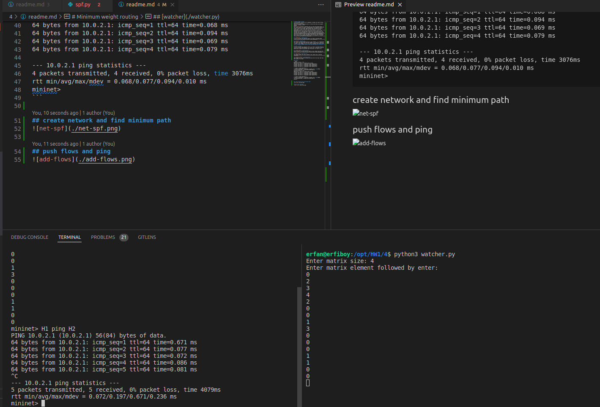
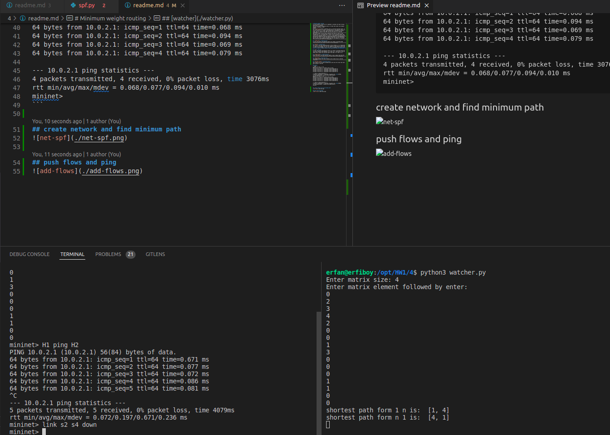

# Minimum weight routing
In this problem, we want you to implement a minimum cost path routing algorithm on a network.
You are provided an adjacency matrix A ∈ Rn×n that holds link weights between n switches in the
network
We use [NetworkX](https://networkx.org/) to find the shortest path. In the create network we create a network based on the adjacency matrix so we get a matrix as an input (each element must followed by an enter). after that we create IP and ARP flows and the push it to the ODL controller.
And we go further form q3 and we observe the state of links in the topology and if a link gone down or goes up we run dijkstra again and find the new shortest path(if it is new !) and replace with the current path only if needed for this we send a get request to the controller and get the status of links and compare them with our last observation and if there is any change we detect and call the modules to recreate the flows and push them to the controller.

## [create_net](./create_net.py)
In this file given the adjacency matrix we create a directed graph using the matrix and connect switches to ODL controller.

## [watcher](./watcher.py)
This file is the most important part of this problem, it is responsible for observe the network and find the changes in the state of links and if there is any changes it will call spf to recompute the shortest path and if it needs to update flows if will push new flows to controller. and we also use a logger that logs events in the link.log where the program runs.

## [spf](./spf.py)
In this file given the adjacency matrix we create a directed graph and calculate shortest path between 1 to n and n to 1. and print a list of nodes which creates the shortest path from node 1 to n and n to 1.

## [create_flows](./create_flow.py)
Given the matrix size and shortest paths it will create flows and the call [send_flows](./create_flow.py) to push them to ODL controller.

## [send_flows](./send_flows.py)
This module pushes the flows created by the create flow to the ODL controller.

## [switches_folder](./switches_flows/)
This folder will be create automatically and store the flows that have been pushed to the ODL.

## Result
### mininet
```bash
erfan@erfiboy:/opt/HW1/4$ sudo python create_net.py 
Enter matrix size: 4
0
2
3
4
2
0
0
1
3
0
0
0
1
1
0
0
mininet> H1 ping H2
PING 10.0.2.1 (10.0.2.1) 56(84) bytes of data.
64 bytes from 10.0.2.1: icmp_seq=1 ttl=64 time=0.671 ms
64 bytes from 10.0.2.1: icmp_seq=2 ttl=64 time=0.077 ms
64 bytes from 10.0.2.1: icmp_seq=3 ttl=64 time=0.072 ms
64 bytes from 10.0.2.1: icmp_seq=4 ttl=64 time=0.086 ms
64 bytes from 10.0.2.1: icmp_seq=5 ttl=64 time=0.081 ms
^C
--- 10.0.2.1 ping statistics ---
5 packets transmitted, 5 received, 0% packet loss, time 4079ms
rtt min/avg/max/mdev = 0.072/0.197/0.671/0.236 ms
mininet> link s2 s4 down
mininet> H1 ping H2
PING 10.0.2.1 (10.0.2.1) 56(84) bytes of data.
64 bytes from 10.0.2.1: icmp_seq=1 ttl=64 time=0.311 ms
64 bytes from 10.0.2.1: icmp_seq=2 ttl=64 time=0.045 ms
64 bytes from 10.0.2.1: icmp_seq=3 ttl=64 time=0.075 ms
^C
--- 10.0.2.1 ping statistics ---
3 packets transmitted, 3 received, 0% packet loss, time 2050ms
rtt min/avg/max/mdev = 0.045/0.143/0.311/0.118 ms
mininet> link s2 s4 up
mininet> 
```
### watcher
```bash
Enter matrix size: 4
Enter matrix element followed by enter: 
0
2
3
4
2
0
0
1
3
0
0
0
1
1
0
0
shortest path form 1 n is:  [1, 4]
shortest path form n 1 is:  [4, 1]
shortest path form 1 n is:  [1, 2, 4]
shortest path form n 1 is:  [4, 1]
```

### logger
```log
2022-05-22 23:00:07,205 - WARNING - change in link2 to 4 changed to inactive occurs!
2022-05-22 23:00:07,205 - WARNING - change in link4 to 2 changed to inactive occurs!
2022-05-22 23:00:07,205 - WARNING - change in link4 to 2 changed to inactive occurs!
2022-05-22 23:00:07,205 - WARNING - change in link2 to 4 changed to inactive occurs!
2022-05-22 23:00:07,205 - WARNING - shortest path form 1 n is: [1, 4]
2022-05-22 23:00:07,205 - WARNING - shortest path form 1 n is: [1, 4]
2022-05-22 23:00:48,594 - WARNING - change in link2 to 4 changed to active occurs!
2022-05-22 23:00:48,594 - WARNING - change in link2 to 4 changed to active occurs!
2022-05-22 23:00:48,594 - WARNING - change in link4 to 2 changed to active occurs!
2022-05-22 23:00:48,594 - WARNING - change in link4 to 2 changed to active occurs!
2022-05-22 23:00:48,594 - WARNING - shortest path form 1 n is: [1, 2, 4]
2022-05-22 23:00:48,594 - WARNING - shortest path form 1 n is: [1, 2, 4]

```


## create network and find minimum path 


## down a link and ping


## up that link and ping again

